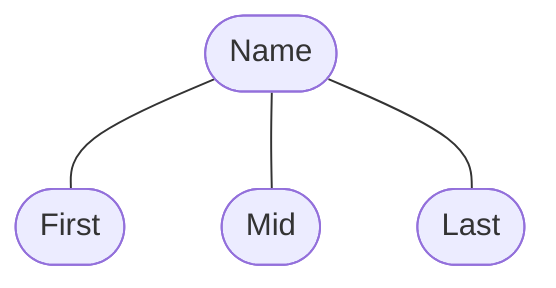

# 09 - ERD Symbols

## Overview

This lesson explains the main symbols used in ERD diagrams. It shows how entities, attributes, relationships, and different attribute types are represented.

## Main Topics

### Basic ERD Symbols

```mermaid
flowchart LR

    E["Entity<br/>Rectangle"]
    WE["Weak Entity<br/>Double Rectangle"]
    A(["Attribute<br/>Ellipse"])
    MA(["Multivalued Attribute<br/>Double Ellipse"])
    DA(["Derived Attribute<br/>Dashed Ellipse"])
    R{"Relationship<br/>Diamond"}
    L["Line"]

    E --- L
    L --- A
    E --- R
    R --- WE
````

### Key Attribute

A **Key Attribute** uniquely identifies each record.

```mermaid
flowchart TB

    E["Entity"]
    K["ID<br/><u>Key Attribute</u>"]

    E --- K
```

### Composite Attribute

A **Composite Attribute** can be divided into smaller attributes.



### Derived Attribute

A **Derived Attribute** is calculated from other data.


### Multivalued Attribute

A **Multivalued Attribute** can contain more than one value.


## Key Takeaways

* Entities are represented by rectangles.
* Weak Entities are represented by double rectangles.
* Attributes are represented by ellipses.
* Multivalued Attributes are represented by double ellipses.
* Derived Attributes are represented by dashed ellipses.
* Relationships are represented by diamonds.
* Lines connect entities, attributes, and relationships.
* Key Attributes are shown with an underline.
* Composite Attributes can be divided into smaller attributes.

[Muwafaa Sinjab] @[**Muwafaa-Sinjab**](https://github.com/Muwafaa-Sinjab)

```
```
