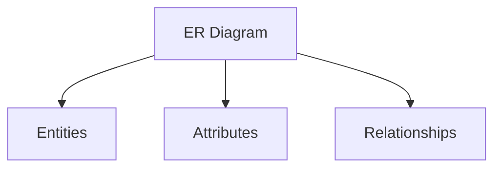
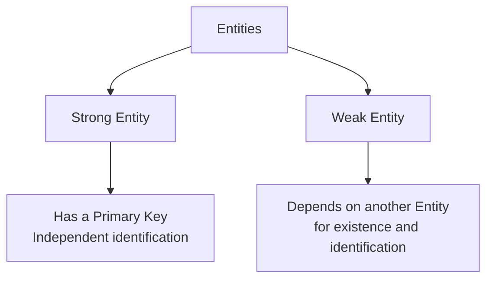
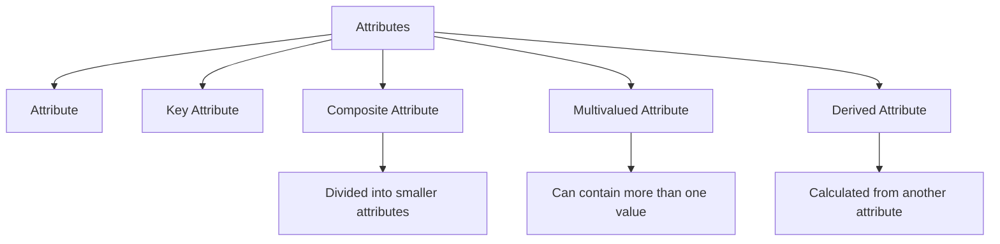
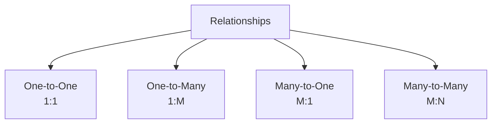

# 10 - Components of ER Diagram

## Overview

This lesson explains the main components of an ER Diagram. It covers Entities, Attributes, and Relationships and their different types.

## Main Topics

### ER Diagram Components

An ER Diagram is based on three main concepts:

### Entities

Entities represent the objects stored in the database.

* **Strong Entity:** Has a Primary Key and independent identification.
* **Weak Entity:** Depends on another entity for its existence and identification.

### Attributes

Attributes are properties or fields that belong to an entity.

* **Attribute:** A general property or field of an entity.
* **Key Attribute:** Uniquely identifies a record.
* **Composite Attribute:** Can be divided into smaller attributes.
* **Multivalued Attribute:** Can contain more than one value.
* **Derived Attribute:** Is calculated from another attribute.

### Relationships

Relationships show how entities are connected.

* **One-to-One (1:1):** One entity is related to one entity.
* **One-to-Many (1:M):** One entity is related to many entities.
* **Many-to-One (M:1):** Many entities are related to one entity.
* **Many-to-Many (M:N):** Many entities are related to many entities.

## Key Takeaways

* An ER Diagram has three main components: Entities, Attributes, and Relationships.
* Entities can be Strong or Weak.
* Attributes can be Key, Composite, Multivalued, or Derived.
* Relationships describe how entities are connected.
* Relationships include 1:1, 1:M, M:1, and M:N.

[Muwafaa Sinjab] @[**Muwafaa-Sinjab**](https://github.com/Muwafaa-Sinjab)