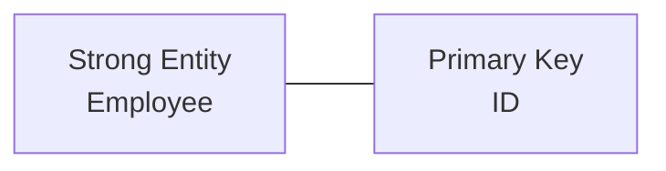
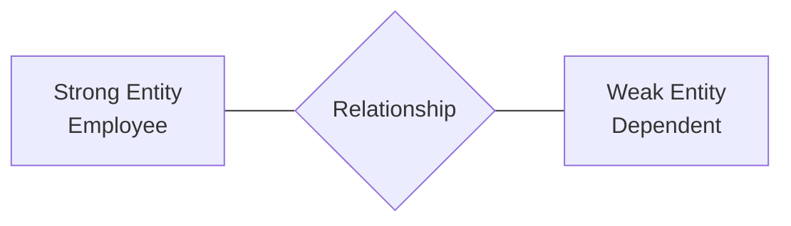
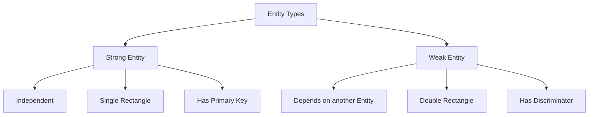

# 11 - Entity vs Weak Entity

## Overview

This lesson explains the difference between Strong Entities and Weak Entities in an ER Diagram. It covers their dependency, symbols, and Primary Keys.

## Main Topics

### Strong Entity

A Strong Entity can exist independently.

In an ERD, it is represented by a single rectangle.

A Strong Entity has a Primary Key.

Examples:

* `Student`
* `Course`
* `Employee`

### Weak Entity

A Weak Entity depends on another entity for its existence and identification.

In an ERD, it is represented by a double rectangle.

A Weak Entity does not have a Primary Key. It has a **Discriminator**.

Example:

* `Dependent` is a Weak Entity.
* `Employee` is a Strong Entity.
* `Employee.ID` is a Primary Key.
* `Dependent` uses its name as a Discriminator.

### Strong Entity vs Weak Entity

| Strong Entity                   | Weak Entity                  |
| ------------------------------- | ---------------------------- |
| Independent.                    | Depends on another entity.   |
| Uses a single rectangle.        | Uses a double rectangle.     |
| Has a Primary Key.              | Does not have a Primary Key. |
| Example: `Employee`, `Student`. | Example: `Dependent`.        |

## Key Takeaways

* A Strong Entity can exist independently.
* A Strong Entity has a Primary Key.
* A Weak Entity depends on another entity.
* A Weak Entity is represented by a double rectangle.
* A Weak Entity does not have a Primary Key.
* A Weak Entity uses a Discriminator for identification.
* `Employee` is an example of a Strong Entity.
* `Dependent` is an example of a Weak Entity.

[Muwafaa Sinjab] @[**Muwafaa-Sinjab**](https://github.com/Muwafaa-Sinjab)