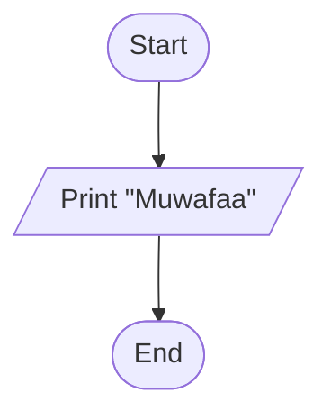

# 01 — Print your name on screen

## Problem statement
Write a program to print your name on screen.

## Flowchart steps

1. **Start** — program begins execution.
2. **Print "Muwafaa"** — output the name to the screen.
3. **End** — program terminates.

