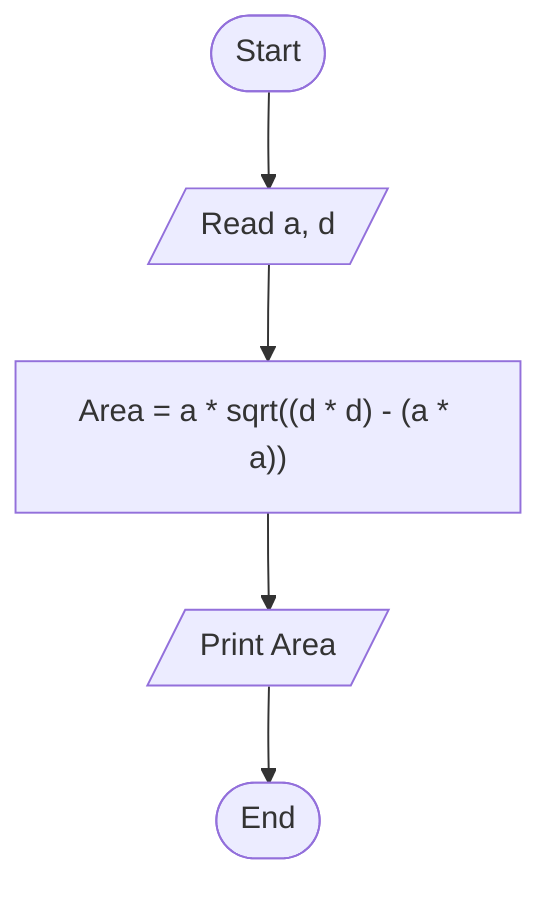

# 16 - Calculate Rectangle Area Through Diagonal and Side

## Problem Statement

Write a program to calculate the area of a rectangle using its side length and diagonal, then print the result on the screen.

## Steps

**Step 1:** Ask the user to enter the side length (`a`) and the diagonal (`d`).

**Step 2:** Calculate the area:

`Area = a * sqrt((d * d) - (a * a))`

**Step 3:** Print the area.

## Flowchart

