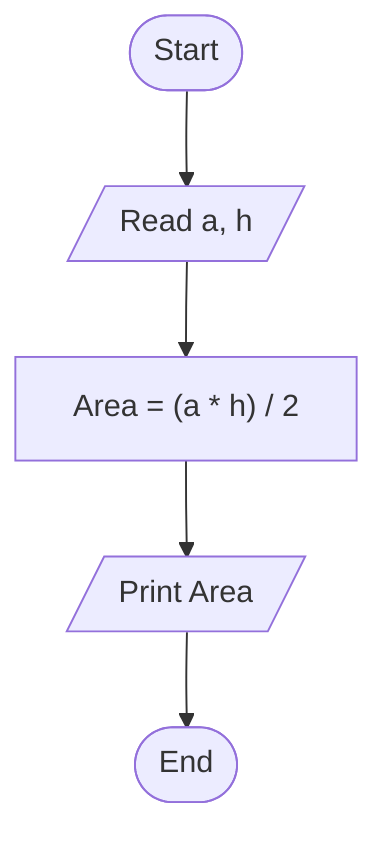

# 17 - Calculate Triangle Area

## Problem Statement

Write a program to calculate the area of a triangle using its base and height, then print the result on the screen.

## Steps

**Step 1:** Ask the user to enter the base (`a`) and the height (`h`).

**Step 2:** Calculate the area:

`Area = (a * h) / 2`

**Step 3:** Print the area.

## Flowchart

