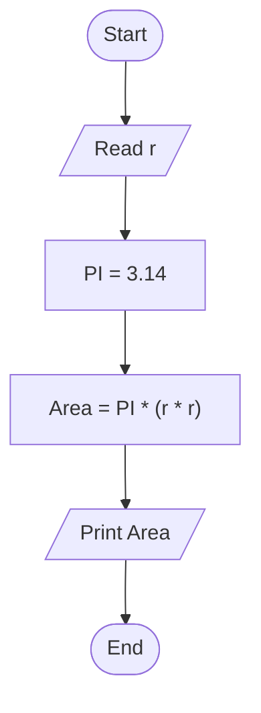

# 18 - Calculate Circle Area

## Problem Statement

Write a program to calculate the area of a circle using its radius, then print the result on the screen.

## Steps

**Step 1:** Ask the user to enter the radius (`r`).

**Step 2:** Set `PI = 3.14`.

**Step 3:** Calculate the area:

`Area = PI * (r * r)`

**Step 4:** Print the area.

## Flowchart

