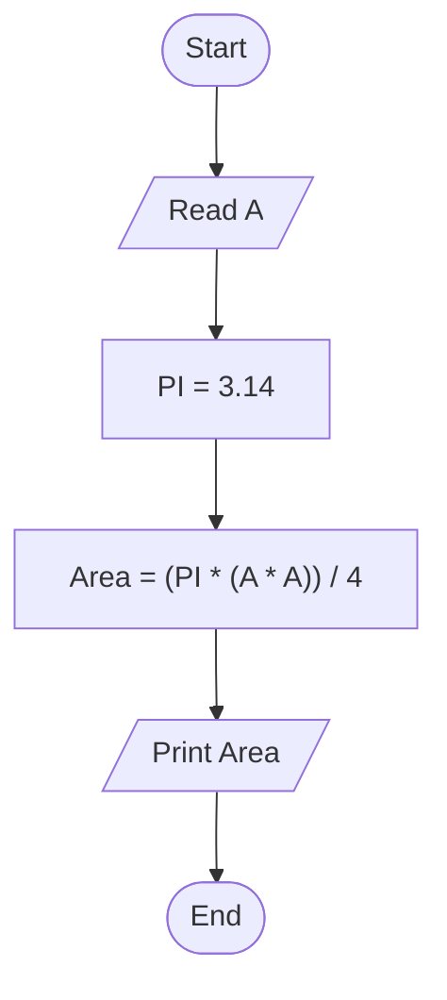

# 20 - Calculate Circle Area Inscribed in a Square

## Problem Statement

Write a program to calculate the area of a circle inscribed in a square, then print the result on the screen.

## Steps

**Step 1:** Ask the user to enter the side length of the square (`A`).

**Step 2:** Set `PI = 3.14`.

**Step 3:** Calculate the area:

`Area = (PI * (A * A)) / 4`

**Step 4:** Print the area.

## Flowchart

