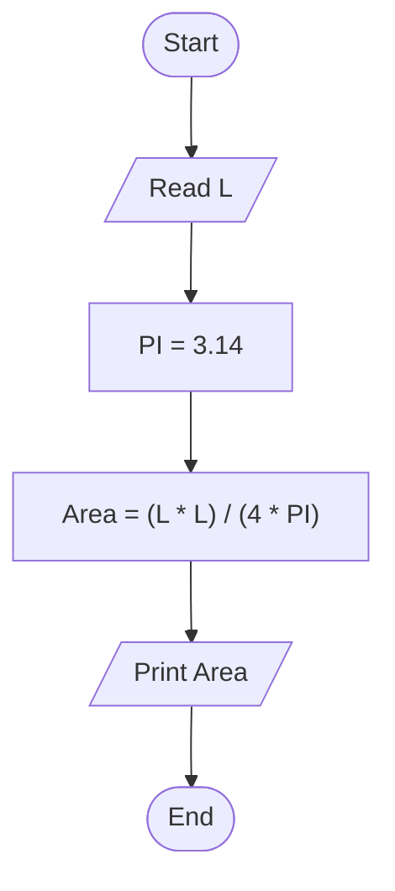

# 21 - Calculate Circle Area Along the Circumference

## Problem Statement

Write a program to calculate the area of a circle using its circumference, then print the result on the screen.

## Steps

**Step 1:** Ask the user to enter the circumference (`L`).

**Step 2:** Set `PI = 3.14`.

**Step 3:** Calculate the area:

`Area = (L * L) / (4 * PI)`

**Step 4:** Print the area.

## Flowchart

