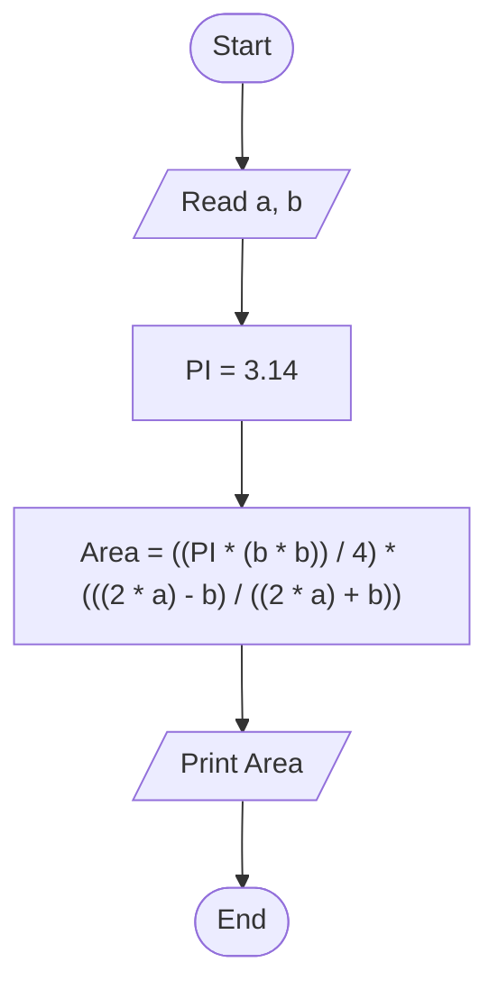

# 22 - Calculate Circle Area Inscribed in an Isosceles Triangle

## Problem Statement

Write a program to calculate the area of a circle inscribed in an isosceles triangle, then print the result on the screen.

## Steps

**Step 1:** Ask the user to enter the equal side (`a`) and the base (`b`).

**Step 2:** Set `PI = 3.14`.

**Step 3:** Calculate the area:

`Area = ((PI * (b * b)) / 4) * (((2 * a) - b) / ((2 * a) + b))`

**Step 4:** Print the area.

## Flowchart

