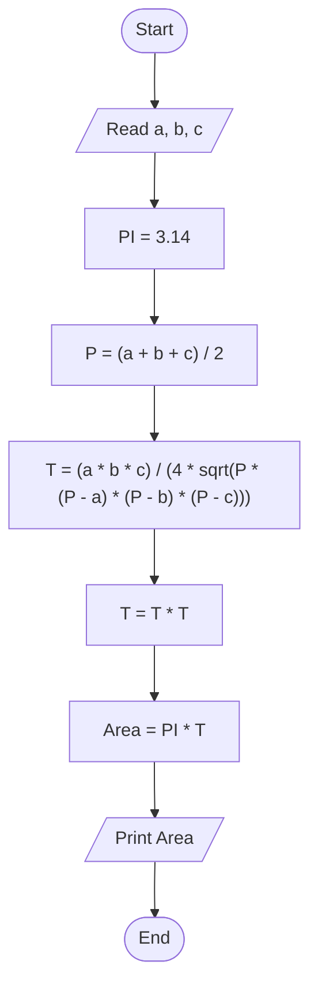

# 23 - Calculate Circle Area Described Around an Arbitrary Triangle

## Problem Statement

Write a program to calculate the area of a circle described around an arbitrary triangle, then print the result on the screen.

## Steps

**Step 1:** Ask the user to enter the sides (`a`), (`b`), and (`c`).

**Step 2:** Set `PI = 3.14`.

**Step 3:** Calculate the semi-perimeter:

`P = (a + b + c) / 2`

**Step 4:** Calculate the radius:

`T = (a * b * c) / (4 * sqrt(P * (P - a) * (P - b) * (P - c)))`

**Step 5:** Square the radius:

`T = T * T`

**Step 6:** Calculate the area:

`Area = PI * T`

**Step 7:** Print the area.

## Flowchart

