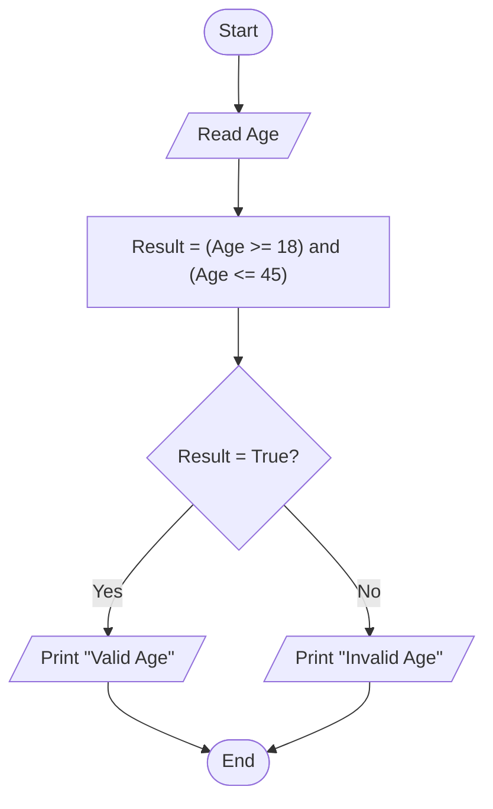

# 24 - Validate Age Range

## Problem Statement

Write a program to ask the user to enter their age. If the age is between 18 and 45 (inclusive), print "Valid Age"; otherwise, print "Invalid Age".

## Steps

**Step 1:** Ask the user to enter their age (`Age`).

**Step 2:** Calculate the result:

`Result = (Age >= 18) and (Age <= 45)`

**Step 3:** Check if `Result` is `True`.

**Step 4:** If `Result` is `True`, print **"Valid Age"**; otherwise, print **"Invalid Age"**.

## Flowchart

