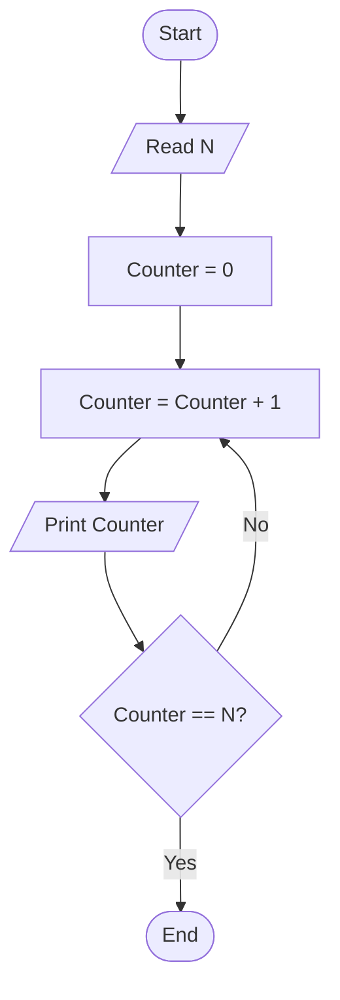

# 26 - Print Numbers from 1 to N

## Problem Statement

Write a program to print the numbers from 1 to **N**.

## Steps

**Step 1:** Ask the user to enter (`N`).

**Step 2:** Set `Counter = 0`.

**Step 3:** Increment the counter:

`Counter = Counter + 1`

**Step 4:** Print `Counter`.

**Step 5:** If `Counter == N`, end the program; otherwise, repeat from **Step 3**.

## Flowchart

