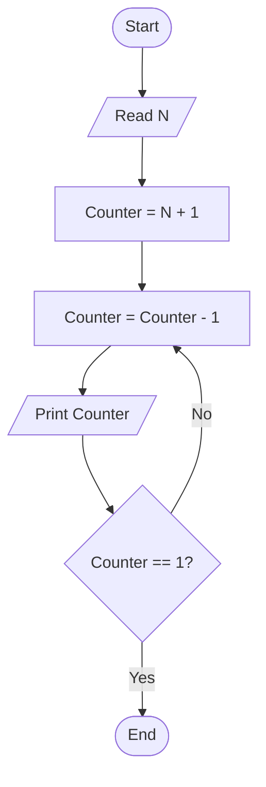

# 27 - Print Numbers from N to 1

## Problem Statement

Write a program to print the numbers from **N** to **1**.

## Steps

**Step 1:** Ask the user to enter (`N`).

**Step 2:** Set `Counter = N + 1`.

**Step 3:** Decrement the counter:

`Counter = Counter - 1`

**Step 4:** Print `Counter`.

**Step 5:** If `Counter == 1`, end the program; otherwise, repeat from **Step 3**.

## Flowchart

