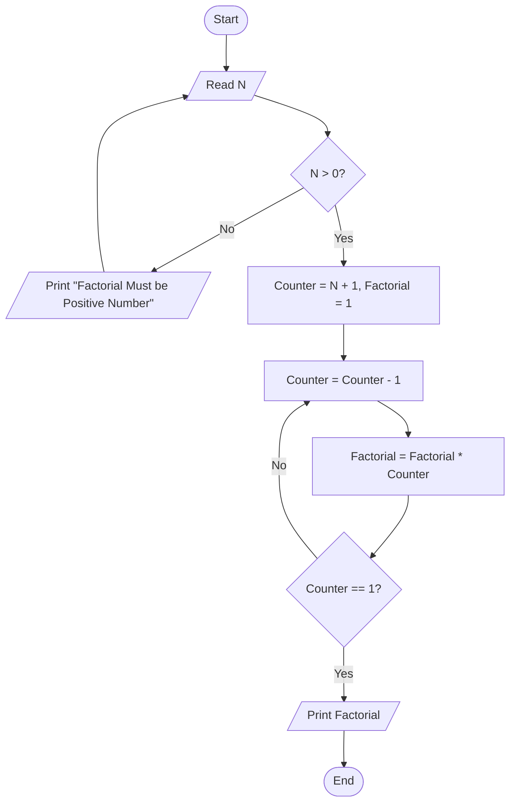

# 30 - Calculate Factorial of N

## Problem Statement

Write a program to calculate the factorial of **N** (`N!`). The user must enter a positive number; otherwise, reject the input and ask for it again.

## Steps

**Step 1:** Ask the user to enter (`N`).

**Step 2:** Check if `N > 0`.

If the condition is `False`, print **"Factorial Must be Positive Number"** and repeat **Step 1**.

**Step 3:** Set `Counter = N + 1` and `Factorial = 1`.

**Step 4:** Decrement the counter:

`Counter = Counter - 1`

**Step 5:** Calculate the factorial:

`Factorial = Factorial * Counter`

**Step 6:** If `Counter == 1`, print `Factorial` and end the program; otherwise, repeat from **Step 4**.

## Flowchart

