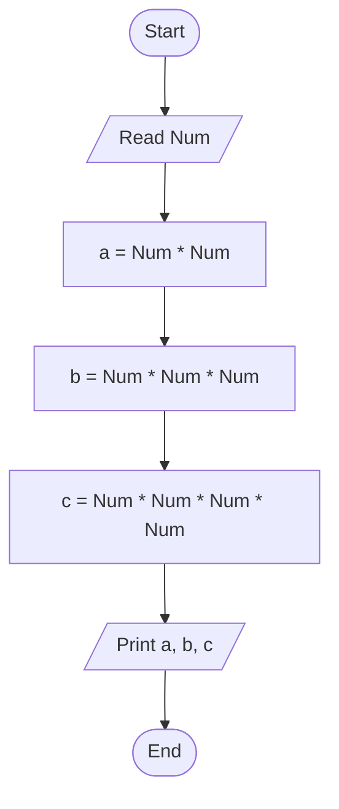

# 31 - Calculate Powers of a Number

## Problem Statement

Write a program to ask the user to enter a number, then print the number squared, cubed, and raised to the fourth power.

## Steps

**Step 1:** Ask the user to enter (`Num`).

**Step 2:** Calculate:

`a = Num * Num`

**Step 3:** Calculate:

`b = Num * Num * Num`

**Step 4:** Calculate:

`c = Num * Num * Num * Num`

**Step 5:** Print `a`, `b`, and `c`.

## Flowchart

