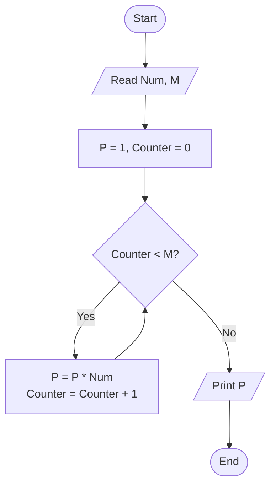

# 32 - Calculate Power of a Number

## Problem Statement

Write a program to ask the user to enter a number and an exponent, then calculate and print the number raised to the power of the exponent.

## Steps

**Step 1:** Ask the user to enter (`Num`) and (`M`).

**Step 2:** Set `P = 1` and `Counter = 0`.

**Step 3:** Check if `Counter < M`.

If the condition is `True`:

`P = P * Num`

`Counter = Counter + 1`

Then repeat **Step 3**.

**Step 4:** Print `P`.

## Flowchart

