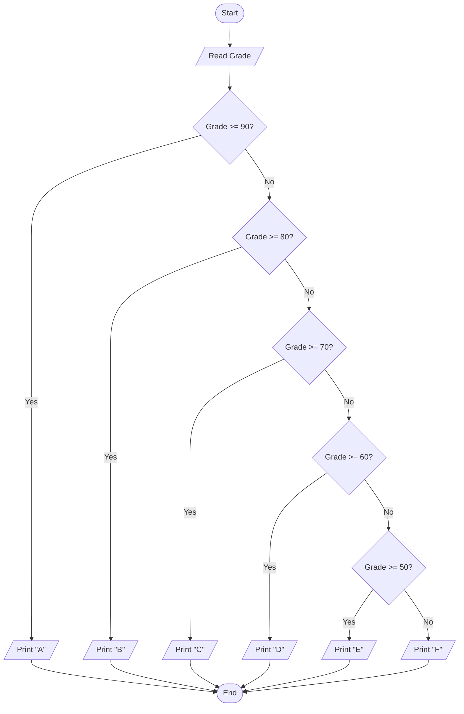

# 33 - Grade Classification

## Problem Statement

Write a program to ask the user to enter a grade, then print the corresponding letter grade according to the following scale:

- **90–100:** A
- **80–89:** B
- **70–79:** C
- **60–69:** D
- **50–59:** E
- **Below 50:** F

## Steps

**Step 1:** Ask the user to enter (`Grade`).

**Step 2:** If `Grade >= 90`, print **"A"**.

**Step 3:** Else if `Grade >= 80`, print **"B"**.

**Step 4:** Else if `Grade >= 70`, print **"C"**.

**Step 5:** Else if `Grade >= 60`, print **"D"**.

**Step 6:** Else if `Grade >= 50`, print **"E"**.

**Step 7:** Otherwise, print **"F"**.

## Flowchart

