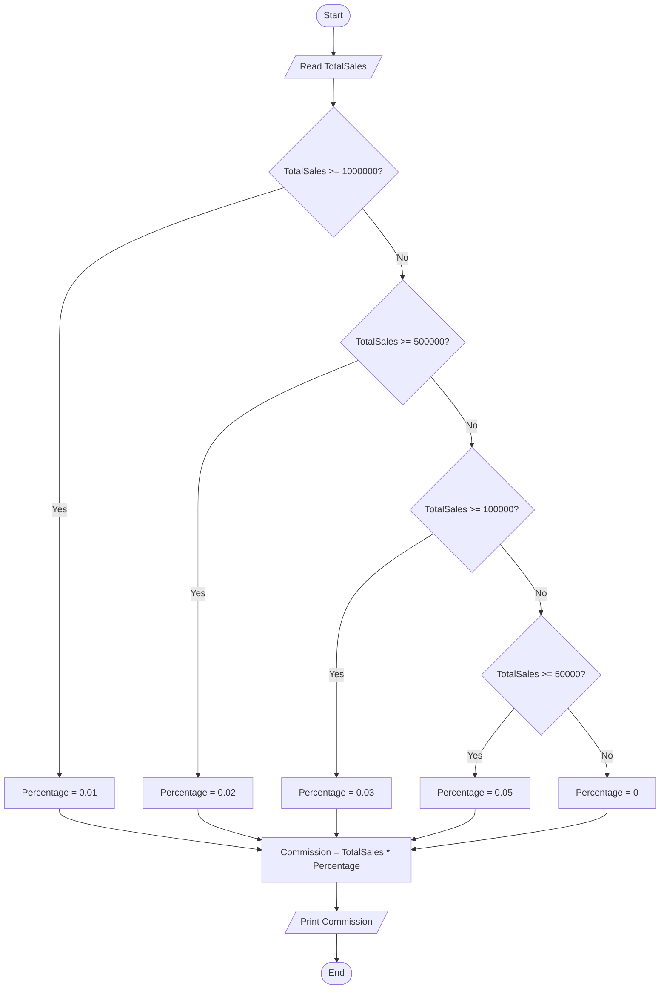

# 34 - Calculate Commission Based on Total Sales

## Problem Statement

Write a program to ask the user to enter the total sales, then calculate and print the commission based on the following rates:

- **1,000,000 or more:** 1%
- **500,000 to less than 1,000,000:** 2%
- **100,000 to less than 500,000:** 3%
- **50,000 to less than 100,000:** 5%
- **Less than 50,000:** 0%

## Steps

**Step 1:** Ask the user to enter (`TotalSales`).

**Step 2:** If `TotalSales >= 1,000,000`, set:

`Percentage = 0.01`

**Step 3:** Else if `TotalSales >= 500,000`, set:

`Percentage = 0.02`

**Step 4:** Else if `TotalSales >= 100,000`, set:

`Percentage = 0.03`

**Step 5:** Else if `TotalSales >= 50,000`, set:

`Percentage = 0.05`

**Step 6:** Otherwise, set:

`Percentage = 0`

**Step 7:** Calculate the commission:

`Commission = TotalSales * Percentage`

**Step 8:** Print `Commission`.

## Flowchart

