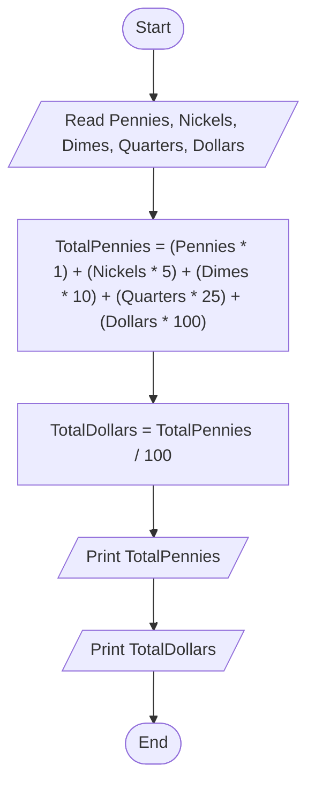

# 35 - Calculate Total Pennies and Dollars

## Problem Statement

Write a program to ask the user to enter the number of pennies, nickels, dimes, quarters, and dollars, then calculate the total value in pennies and dollars and print both results.

## Steps

**Step 1:** Ask the user to enter (`Pennies`), (`Nickels`), (`Dimes`), (`Quarters`), and (`Dollars`).

**Step 2:** Calculate the total number of pennies:

`TotalPennies = (Pennies * 1) + (Nickels * 5) + (Dimes * 10) + (Quarters * 25) + (Dollars * 100)`

**Step 3:** Calculate the total number of dollars:

`TotalDollars = TotalPennies / 100`

**Step 4:** Print `TotalPennies`.

**Step 5:** Print `TotalDollars`.

## Flowchart

