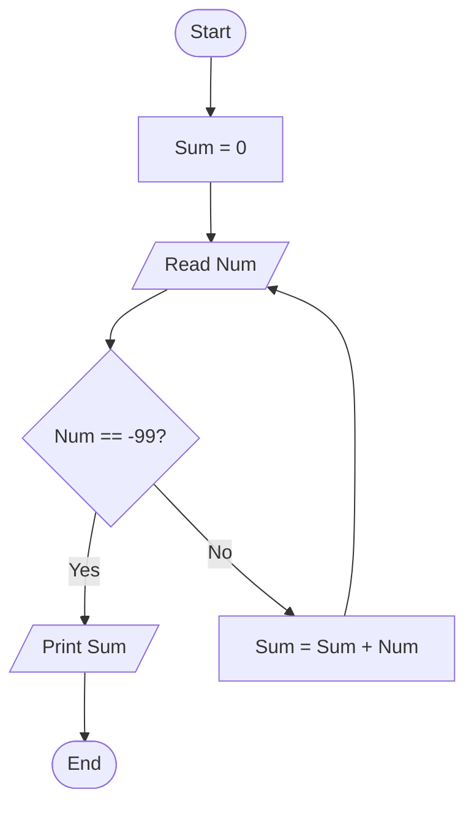

# 37 - Sum Numbers Until -99

## Problem Statement

Write a program to continuously read numbers from the user and calculate their sum. Stop reading when the user enters **-99**, then print the total sum.

## Steps

**Step 1:** Set `Sum = 0`.

**Step 2:** Ask the user to enter (`Num`).

**Step 3:** Check if `Num == -99`.

**Step 4:** If the condition is `True`, print `Sum` and end the program.

**Step 5:** Otherwise, calculate:

`Sum = Sum + Num`

Then repeat from **Step 2**.

## Flowchart

