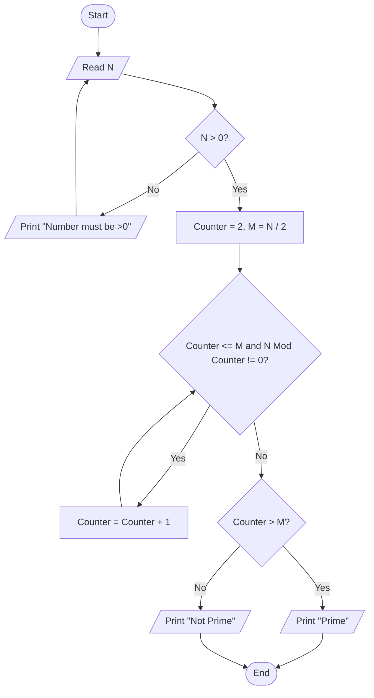

# 38 - Check Prime Number

## Problem Statement

Write a program to read a number and determine whether it is a prime number or not.

## Steps

**Step 1:** Ask the user to enter (`N`).

**Step 2:** Check if `N > 0`.

If the condition is `False`, print **"Number must be > 0"** and repeat **Step 1**.

**Step 3:** Set `Counter = 2`.

**Step 4:** Calculate:

`M = N / 2`

**Step 5:** While:

`(Counter <= M) and (N % Counter != 0)`

increment the counter:

`Counter = Counter + 1`

**Step 6:** If `Counter > M`, print **"Prime"**.

**Step 7:** Otherwise, print **"Not Prime"**.

## Flowchart

