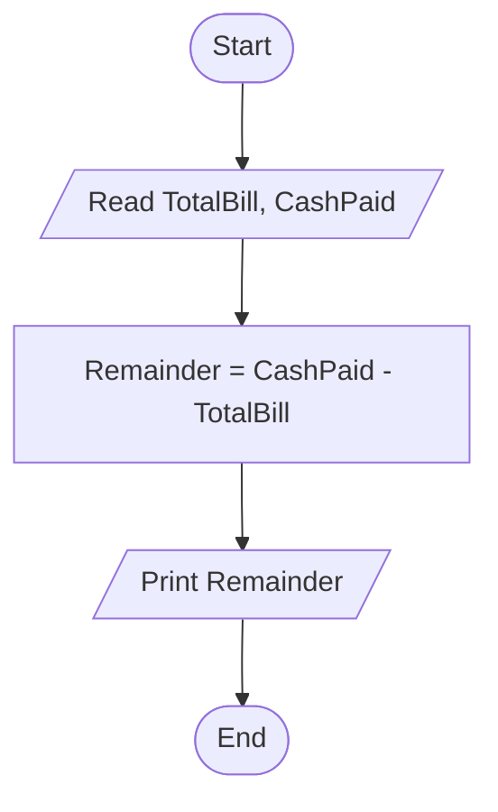

# 39 - Calculate Remainder from Bill Payment

## Problem Statement

Write a program to read the total bill and the amount of cash paid, then calculate and print the remaining amount to be returned to the customer.

## Steps

**Step 1:** Ask the user to enter (`TotalBill`) and (`CashPaid`).

**Step 2:** Calculate:

`Remainder = CashPaid - TotalBill`

**Step 3:** Print `Remainder`.

## Flowchart

