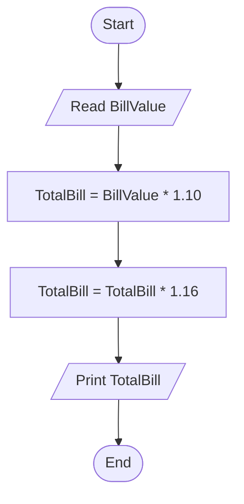

# 40 - Calculate Total Bill with Service Fee and Sales Tax

## Problem Statement

Write a program to read the bill value, add a **10%** service fee and **16%** sales tax, then calculate and print the total bill.

## Steps

**Step 1:** Ask the user to enter (`BillValue`).

**Step 2:** Add the service fee:

`TotalBill = BillValue * 1.10`

**Step 3:** Add the sales tax:

`TotalBill = TotalBill * 1.16`

**Step 4:** Print `TotalBill`.

## Flowchart

