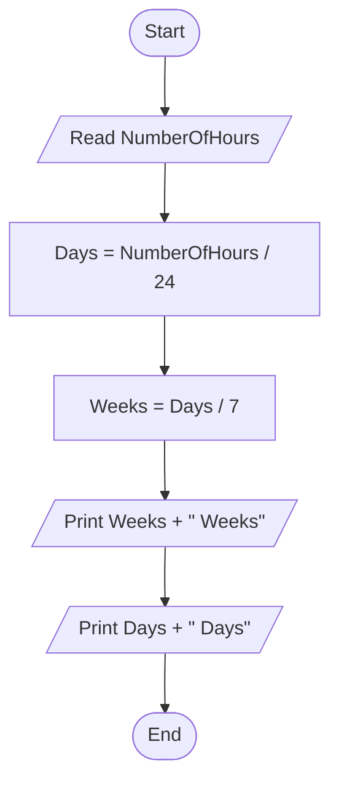

# 41 - Convert Hours to Weeks and Days

## Problem Statement

Write a program to read the number of hours, then calculate and print the equivalent number of weeks and days.

## Steps

**Step 1:** Ask the user to enter (`NumberOfHours`).

**Step 2:** Calculate the number of days:

`Days = NumberOfHours / 24`

**Step 3:** Calculate the number of weeks:

`Weeks = Days / 7`

**Step 4:** Print `Weeks` followed by **"Weeks"**.

**Step 5:** Print `Days` followed by **"Days"**.

## Flowchart

