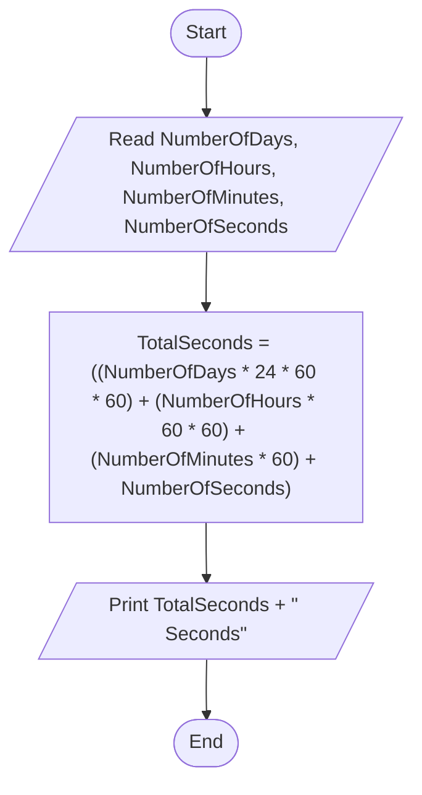

# 42 - Calculate Task Duration in Seconds

## Problem Statement

Write a program to calculate the duration of a task in seconds, given the number of days, hours, minutes, and seconds, then print the total duration.

## Steps

**Step 1:** Ask the user to enter (`NumberOfDays`), (`NumberOfHours`), (`NumberOfMinutes`), and (`NumberOfSeconds`).

**Step 2:** Calculate the total number of seconds:

`TotalSeconds = ((NumberOfDays * 24 * 60 * 60) + (NumberOfHours * 60 * 60) + (NumberOfMinutes * 60) + NumberOfSeconds)`

**Step 3:** Print `TotalSeconds` followed by **"Seconds"**.

## Flowchart

