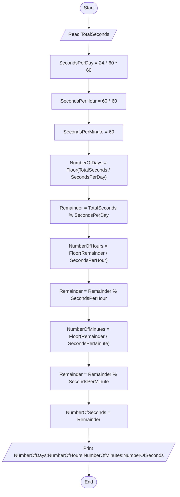

# 43 - Convert Seconds to Days, Hours, Minutes, and Seconds

## Problem Statement

Write a program to read the total number of seconds, then convert and print it as days, hours, minutes, and seconds.

## Steps

**Step 1:** Ask the user to enter (`TotalSeconds`).

**Step 2:** Set:

`SecondsPerDay = 24 * 60 * 60`

**Step 3:** Set:

`SecondsPerHour = 60 * 60`

**Step 4:** Set:

`SecondsPerMinute = 60`

**Step 5:** Calculate:

`NumberOfDays = Floor(TotalSeconds / SecondsPerDay)`

**Step 6:** Calculate:

`Remainder = TotalSeconds % SecondsPerDay`

**Step 7:** Calculate:

`NumberOfHours = Floor(Remainder / SecondsPerHour)`

**Step 8:** Calculate:

`Remainder = Remainder % SecondsPerHour`

**Step 9:** Calculate:

`NumberOfMinutes = Floor(Remainder / SecondsPerMinute)`

**Step 10:** Calculate:

`Remainder = Remainder % SecondsPerMinute`

**Step 11:** Calculate:

`NumberOfSeconds = Remainder`

**Step 12:** Print:

`NumberOfDays:NumberOfHours:NumberOfMinutes:NumberOfSeconds`

## Flowchart

