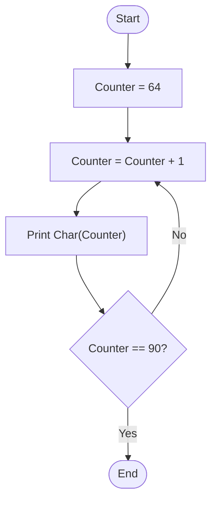

# 46 - Print Letters from A to Z

## Problem Statement

Write a program to print all uppercase letters from **A** to **Z**.

## Steps

**Step 1:** Set `Counter = 64`.

**Step 2:** Increment the counter:

`Counter = Counter + 1`

**Step 3:** Print:

`Char(Counter)`

**Step 4:** If `Counter == 90`, end the program; otherwise, repeat from **Step 2**.

## Flowchart

